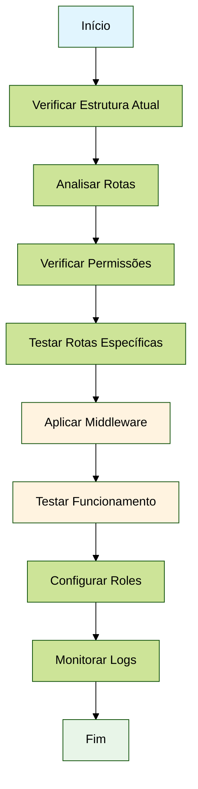
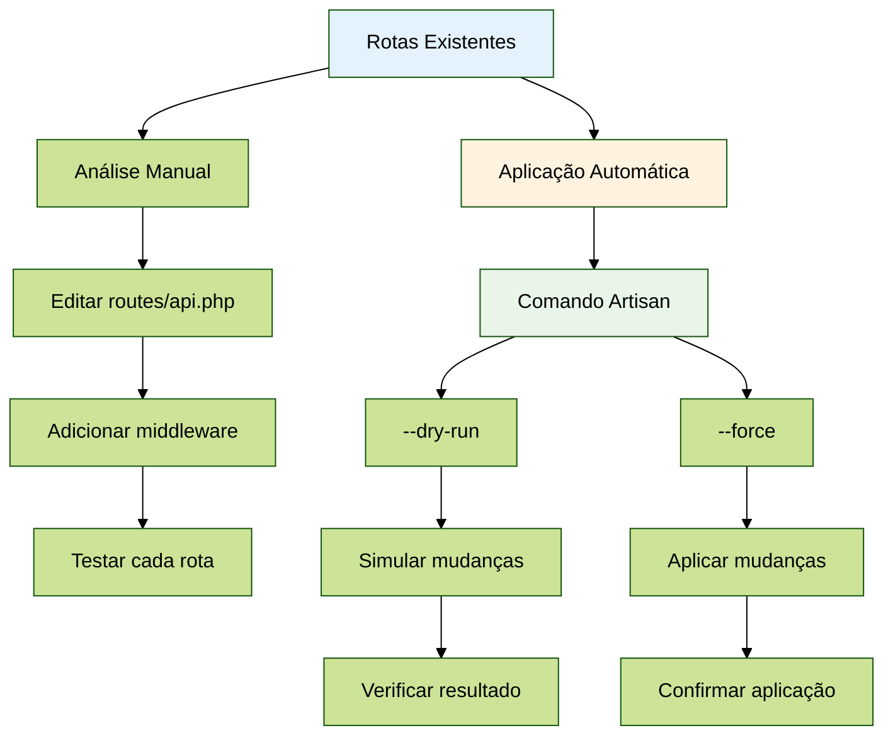
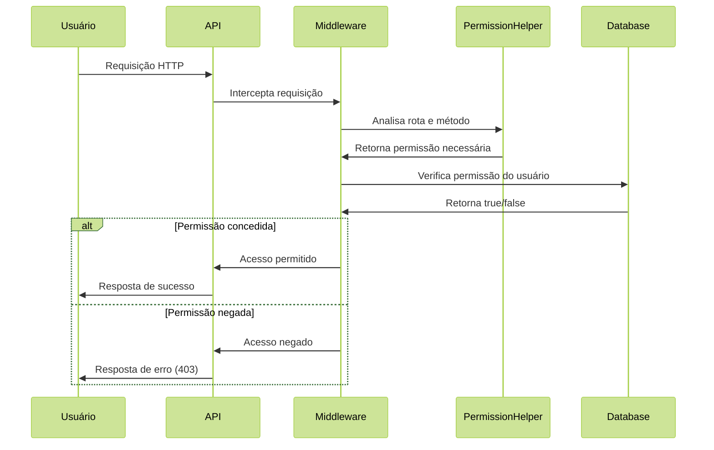
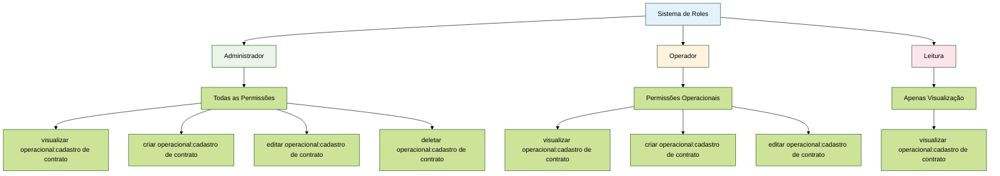
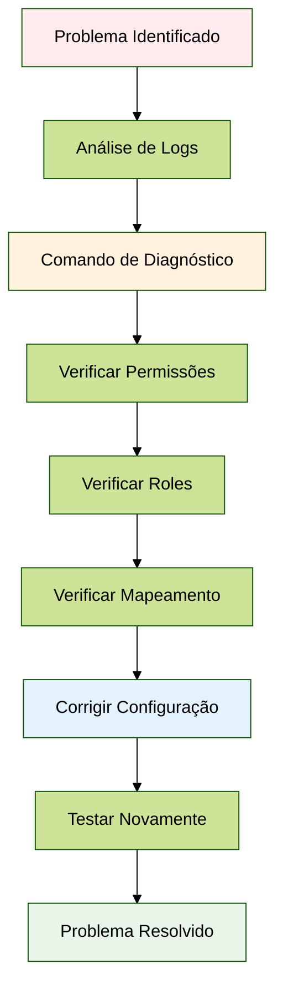

# Exemplo Prático - Sistema de Middleware de Permissões

## Cenário: Aplicação de Controle de Acesso

Simulação de um cenário real onde  precisa aplicar o middleware de permissões no sistema.

## Fluxo de Implementação



## Passo 1: Verificar Estrutura Atual

### Comando para Analisar Rotas

```bash
# Analisar todas as rotas do sistema
php artisan permission:test --analyze
```

**Saída esperada:**
```
=== Análise de Rotas ===
┌─────────────────────────────────────┬────────┬─────────────────────────────────────┬─────────┬─────────┬─────────────────────────────────────┐
│ Rota                                │ Método │ Permissão                           │ Ignorada│ Ação    │ Recurso                             │
├─────────────────────────────────────┼────────┼─────────────────────────────────────┼─────────┼─────────┼─────────────────────────────────────┤
│ health                              │ GET    │ N/A                                 │ Sim     │ N/A     │ N/A                                 │
│ api/health                          │ GET    │ N/A                                 │ Sim     │ N/A     │ N/A                                 │
│ api/consignado/leads                │ GET    │ visualizar operacional:cadastro de contrato │ Não │ visualizar│ operacional:cadastro de contrato │
│ api/consignado/leads                │ POST   │ criar operacional:cadastro de contrato     │ Não │ criar   │ operacional:cadastro de contrato   │
│ api/consignado/users                │ GET    │ visualizar cadastros:usuários       │ Não     │ visualizar│ cadastros:usuários                │
│ api/consignado/users                │ POST   │ criar cadastros:usuários            │ Não     │ criar   │ cadastros:usuários                 │
│ api/consignado/permissions          │ GET    │ visualizar permissões de acesso:permissões │ Não │ visualizar│ permissões de acesso:permissões │
│ api/consignado/groups               │ GET    │ visualizar permissões de acesso:grupos    │ Não │ visualizar│ permissões de acesso:grupos       │
│ api/consignado/menus/available-permissions │ GET │ visualizar menus                │ Não     │ visualizar│ menus                             │
└─────────────────────────────────────┴────────┴─────────────────────────────────────┴─────────┴─────────┴─────────────────────────────────────┘
```

## Passo 2: Verificar Permissões Disponíveis

```bash
# Listar permissões do sistema
php artisan permission:test --list
```

**Saída esperada:**
```
=== Permissões Disponíveis ===
  - visualizar dashboard
  - criar dashboard
  - editar dashboard
  - deletar dashboard
  - visualizar leilão:motor de leilão
  - criar leilão:motor de leilão
  - editar leilão:motor de leilão
  - deletar leilão:motor de leilão
  - visualizar leilão:lances no leilão
  - criar leilão:lances no leilão
  - editar leilão:lances no leilão
  - deletar leilão:lances no leilão
  - visualizar cadastros:beneficiário/trabalhador
  - criar cadastros:beneficiário/trabalhador
  - editar cadastros:beneficiário/trabalhador
  - deletar cadastros:beneficiário/trabalhador
  - visualizar cadastros:usuários
  - criar cadastros:usuários
  - editar cadastros:usuários
  - deletar cadastros:usuários
  - visualizar operacional:cadastro de contrato
  - criar operacional:cadastro de contrato
  - editar operacional:cadastro de contrato
  - deletar operacional:cadastro de contrato
  - visualizar operacional:esteira de contrato
  - criar operacional:esteira de contrato
  - editar operacional:esteira de contrato
  - deletar operacional:esteira de contrato
  - visualizar relatórios:relatório a
  - criar relatórios:relatório a
  - editar relatórios:relatório a
  - deletar relatórios:relatório a
  - visualizar relatórios:relatório b
  - criar relatórios:relatório b
  - editar relatórios:relatório b
  - deletar relatórios:relatório b
  - visualizar relatórios:relatório c
  - criar relatórios:relatório c
  - editar relatórios:relatório c
  - deletar relatórios:relatório c
  - visualizar configurações:conexões averbadoras
  - criar configurações:conexões averbadoras
  - editar configurações:conexões averbadoras
  - deletar configurações:conexões averbadoras
  - visualizar permissões de acesso:permissões
  - criar permissões de acesso:permissões
  - editar permissões de acesso:permissões
  - deletar permissões de acesso:permissões
  - visualizar permissões de acesso:grupos
  - criar permissões de acesso:grupos
  - editar permissões de acesso:grupos
  - deletar permissões de acesso:grupos
  - visualizar menus
  - criar menus
  - editar menus
  - deletar menus
```

## Passo 3: Testar Rota Específica

```bash
# Testar uma rota específica
php artisan permission:test --route=api/consignado/leads --method=GET --user=1
```

**Saída esperada:**
```
=== Testando Rota: GET /api/consignado/leads ===
Análise da Requisição:
  Path: api/consignado/leads
  Método: GET
  Permissão: visualizar operacional:cadastro de contrato
  Ignorada: Não
  Ação: visualizar
  Recurso: operacional:cadastro de contrato
  Permissão Válida: Sim

=== Permissões do Usuário ===
Nome: Administrador
Email: admin@econsignado.com
Roles: Administrador
Permissões: visualizar operacional:cadastro de contrato, criar operacional:cadastro de contrato, editar operacional:cadastro de contrato, deletar operacional:cadastro de contrato, visualizar cadastros:usuários, criar cadastros:usuários, editar cadastros:usuários, deletar cadastros:usuários

=== Teste de Permissão ===
Permissão Necessária: visualizar operacional:cadastro de contrato
Usuário Tem Permissão: Sim
```

## Passo 4: Aplicar Middleware nas Rotas

### Fluxo de Aplicação do Middleware



### Opção A: Aplicação Manual

Editar `routes/api.php`:

```php
Route::prefix('consignado')->group(function () {
    Route::middleware(['permission.check'])->group(function () {
        // Todas as rotas aqui serão verificadas automaticamente
        Route::get('/leads', [LeadController::class, 'index']);
        Route::post('/leads', [LeadController::class, 'store']);
        Route::put('/leads/{id}', [LeadController::class, 'update']);
        Route::delete('/leads/{id}', [LeadController::class, 'destroy']);
        
        Route::get('/users', [UserController::class, 'index']);
        Route::post('/users', [UserController::class, 'store']);
        Route::put('/users/{id}', [UserController::class, 'update']);
        Route::delete('/users/{id}', [UserController::class, 'destroy']);
        
        Route::get('/permissions', [PermissionController::class, 'index']);
        Route::get('/groups', [GroupController::class, 'index']);
        Route::get('/menus/available-permissions', [MenuController::class, 'getAvailablePermissions']);
        // ...
    });
});
```

### Opção B: Aplicação Automática

```bash
# Simular aplicação (dry-run)
php artisan permission:apply-middleware --routes=api --dry-run

# Aplicar realmente
php artisan permission:apply-middleware --routes=api
```

## Passo 5: Testar Funcionamento

### Fluxo de Teste de Permissões



### 1. Usuário com Permissão

```bash
# Fazer requisição como usuário com permissão
curl -X GET http://localhost/api/consignado/leads \
  -H "Authorization: Bearer {token}" \
  -H "Content-Type: application/json"
```

**Resposta esperada:**
```json
{
  "code": "SUCCESS-LEADS-0001",
  "message": "Leads listed successfully.",
  "status_code": 200,
  "payload": {
    "data": [...]
  }
}
```

### 2. Usuário sem Permissão

```bash
# Fazer requisição como usuário sem permissão
curl -X GET http://localhost/api/consignado/leads \
  -H "Authorization: Bearer {token}" \
  -H "Content-Type: application/json"
```

**Resposta esperada:**
```json
{
  "message": "Acesso negado. Você não possui permissão para acessar este recurso.",
  "code": "PERMISSION_DENIED",
  "required_permission": "visualizar operacional:cadastro de contrato",
  "path": "api/consignado/leads",
  "method": "GET"
}
```

## Passo 6: Verificar Logs

```bash
# Verificar logs de permissões
tail -f storage/logs/laravel.log | grep Permission
```

**Logs esperados:**
```
[2024-01-15 10:30:15] local.INFO: PermissionHelper::analyzeRequest - Analisando requisição {"path":"api/consignado/leads","method":"GET","url":"http://localhost/api/consignado/leads"}
[2024-01-15 10:30:15] local.INFO: PermissionHelper::analyzeRequest - Permissão identificada {"permission":"visualizar operacional:cadastro de contrato","action":"visualizar","resource":"operacional:cadastro de contrato","path":"api/consignado/leads","method":"GET"}
[2024-01-15 10:30:15] local.INFO: PermissionMiddleware - Verificação de permissão {"user_id":1,"user_email":"admin@econsignado.com","path":"api/consignado/leads","method":"GET","required_permission":"visualizar operacional:cadastro de contrato","has_permission":true,"user_roles":["Administrador"],"user_permissions":["visualizar operacional:cadastro de contrato","criar operacional:cadastro de contrato","editar operacional:cadastro de contrato","deletar operacional:cadastro de contrato"]}
[2024-01-15 10:30:15] local.INFO: PermissionMiddleware - Acesso permitido {"user_id":1,"path":"api/consignado/leads","method":"GET","permission":"visualizar operacional:cadastro de contrato"}
```

## Passo 7: Configurar Roles e Permissões

### Estrutura de Roles e Permissões



### 1. Criar Roles

```php
// Em um seeder ou comando
use Spatie\Permission\Models\Role;
use Spatie\Permission\Models\Permission;

// Role Administrador
$adminRole = Role::create(['name' => 'Administrador']);
$adminRole->givePermissionTo(Permission::all());

// Role Operador
$operatorRole = Role::create(['name' => 'Operador']);
$operatorRole->givePermissionTo([
    'visualizar operacional:cadastro de contrato',
    'criar operacional:cadastro de contrato',
    'editar operacional:cadastro de contrato',
    'visualizar cadastros:usuários',
    'criar cadastros:usuários',
    'editar cadastros:usuários'
]);

// Role Leitura
$readerRole = Role::create(['name' => 'Leitura']);
$readerRole->givePermissionTo([
    'visualizar operacional:cadastro de contrato',
    'visualizar cadastros:usuários'
]);
```

### 2. Atribuir Roles aos Usuários

```php
// Atribuir role a um usuário
$user = User::find(1);
$user->assignRole('Administrador');

// Verificar permissões
$user->hasPermissionTo('visualizar operacional:cadastro de contrato'); // true
$user->hasPermissionTo('criar operacional:cadastro de contrato');      // true
$user->hasPermissionTo('deletar operacional:cadastro de contrato');    // true
```

## Passo 8: Monitoramento e Debug

### Fluxo de Debug



### 1. Comando de Diagnóstico

```bash
# Verificar permissões de um usuário específico
php artisan permission:test --user=1 --route=api/consignado/leads --method=GET
```

### 2. Verificar Rotas Não Mapeadas

```bash
# Analisar rotas que não geraram permissões
php artisan permission:test --analyze | grep "N/A"
```

### 3. Adicionar Novos Mapeamentos

Se uma rota não está sendo mapeada corretamente, adicione ao `PermissionHelper`:

```php
// Em app/Helpers/PermissionHelper.php
private static array $specificRouteToResource = [
    'api/consignado/leads' => 'operacional:cadastro de contrato',
    'api/consignado/users' => 'cadastros:usuários',
    'api/consignado/novo-recurso' => 'novo recurso', // Adicionar aqui
];
```

## Cenários de Teste

### Cenário 1: Usuário Administrador

```bash
# Testar acesso completo
php artisan permission:test --user=1 --route=api/consignado/users --method=POST
# Resultado: Permissão concedida
```

### Cenário 2: Usuário Operador

```bash
# Testar acesso limitado
php artisan permission:test --user=2 --route=api/consignado/users --method=DELETE
# Resultado: Permissão negada (operador não pode deletar)
```

### Cenário 3: Usuário Leitura

```bash
# Testar acesso apenas visualização
php artisan permission:test --user=3 --route=api/consignado/leads --method=GET
# Resultado: Permissão concedida (apenas visualizar)
```

## Troubleshooting

### Problema 1: Rota não identificada

**Sintoma:** Log mostra "Permissão não identificada"

**Solução:**
1. Verificar se a rota está no mapeamento específico
2. Adicionar novo padrão no `PermissionHelper`
3. Verificar se a rota não está na lista de ignoradas

### Problema 2: Acesso negado inesperado

**Sintoma:** Usuário com role correta recebe acesso negado

**Solução:**
1. Verificar se a permissão existe no banco
2. Verificar se o usuário tem a role correta
3. Verificar se a role tem a permissão necessária

### Problema 3: Performance

**Sintoma:** Sistema lento devido a muitas verificações

**Solução:**
1. Usar cache para permissões
2. Otimizar queries do banco
3. Considerar verificações em lote

## Integração com Keycloak

### Criar Usuários do Sistema

```bash
# Criar os três usuários padrão
php artisan users:create-system-users
```

**Usuários criados:**
- **Administrador** (admin@econsignado.com) - Todas as permissões
- **Operador** (operador@econsignado.com) - Permissões operacionais  
- **Leitor** (leitor@econsignado.com) - Apenas visualização

### Sincronizar Usuários

```bash
# Sincronizar usuários órfãos
php artisan users:sync-orphans

# Verificar consistência
php artisan users:check-consistency
```

## Conclusão

O sistema de middleware com predição estática oferece uma solução elegante e automatizada para controle de acesso, eliminando a necessidade de configuração manual de permissões em cada rota, mantendo a segurança e facilitando a manutenção do sistema. A integração com Keycloak garante sincronização adequada de identidades.