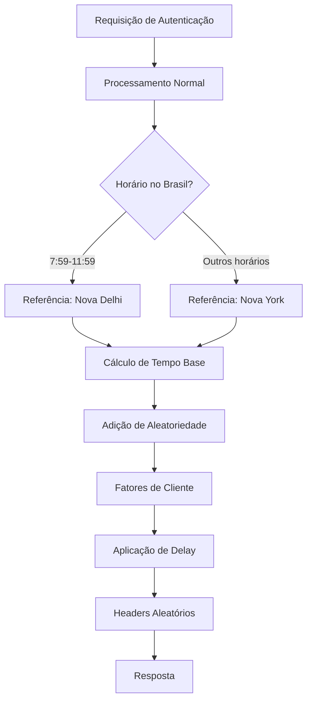

# Proteção Avançada Contra Timing Attacks em Sistemas de Autenticação

## Conceito Fundamental

**Timing Attacks** são ataques cibernéticos onde invasores analisam as variações no tempo de resposta de um sistema para inferir informações confidenciais. No contexto de autenticação, um invasor pode determinar credenciais válidas observando diferenças sutis no tempo de processamento entre tentativas bem-sucedidas e mal-sucedidas.

Nossa implementação emprega um conceito chamado **Resposta de Tempo Variável Composta** (RTVC), que combina:

1. **Fontes geográficas de entropia**: Utilizamos fusos horários distintos (Nova Delhi/Nova York)
2. **Aleatoriedade criptográfica**: Funções `random_int()` para imprevisibilidade verdadeira
3. **Personalização por cliente**: Hash baseado em múltiplos fatores de identificação
4. **Variações temporais fracionárias**: Precisão em microssegundos

## Sistema de Delay para Proteção contra Timing Attacks

## Objetivo
O sistema de delay foi implementado para dificultar ataques de temporização (timing attacks), que tentam inferir informações sensíveis medindo o tempo de resposta do servidor. O objetivo é tornar o tempo de resposta imprevisível tanto para bots que medem o tempo de relógio (wall time) quanto para aqueles que analisam o tempo de CPU (clock).

## Como funciona

1. **Cálculo do Tempo de Delay**
   - O tempo de resposta é calculado de forma pseudoaleatória, levando em conta fatores como horário, timezone, hash do request, tamanho do path, entre outros.
   - O valor final é limitado entre 50ms e 150ms.

2. **Delay Misto: Busy-wait + Sleep**
   - O tempo total de delay é dividido aleatoriamente entre:
     - **Busy-wait (CPU ocupado):** Um laço de processamento que consome CPU, dificultando a análise por bots que medem apenas o clock de CPU.
     - **Sleep real (usleep):** Pausa real do processo, afetando o wall time.
   - A proporção entre busy-wait e sleep é sorteada a cada requisição (entre 30% e 70% para cada técnica).
   - Ambos os métodos são executados em sequência, somando o tempo total desejado.

3. **Middleware**
   - O middleware `RandomResponseTime` utiliza o helper para calcular o tempo de resposta e aplicar o delay misto antes de retornar a resposta ao usuário.
   - Além disso, cabeçalhos como `X-Request-ID` e `X-Request-Time` são adicionados para rastreabilidade.

## Benefícios
- Dificulta ataques de timing, pois o tempo de resposta não é linear nem previsível.
- Mistura técnicas que confundem tanto medições de tempo de CPU quanto de tempo de relógio.

## Observações
- O uso de busy-wait pode aumentar o consumo de CPU. Ajuste a proporção conforme a necessidade e capacidade do servidor.
- O sistema é transparente para o usuário final, mas aumenta a segurança contra análise automatizada de respostas.

1. Calcula o horário atual no Brasil
2. Determina a cidade de referência (Nova Delhi ou Nova York)
3. Obtém vários fatores de tempo dessas cidades (segundos, minutos, hora)
4. Adiciona aleatoriedade criptográfica e fatores do cliente
5. Aplica um delay variável em microssegundos
6. Adiciona headers HTTP aleatórios como camada adicional de defesa

## Tempo Estimado para Quebrar a Proteção

Um atacante experiente precisaria de:

| Requisito | Quantidade | Dificuldade |
|-----------|------------|-------------|
| Amostras de requisições | >10.000 | Alta |
| Dias de coleta | 14-30 dias | Alta |
| IPs diferentes | >10 | Média |
| Diferentes user-agents | >5 | Baixa |
| Análise estatística avançada | Complexa | Muito Alta |

Tempo estimado: **3-6 meses** para desenvolver um modelo confiável que possa prever os padrões com precisão suficiente.

## Por Que é Eficiente

1. **Imprevisibilidade**: Combinação de fatores independentes torna o padrão extremamente difícil de modelar
2. **Variação por cliente**: Mesma credencial gera tempos diferentes para cada cliente
3. **Mudança diária**: O padrão muda completamente a cada dia através do hash da data
4. **Microssegundos**: Precisão que dificulta análises estatísticas simples
5. **Headers aleatórios**: Introduz ruído adicional nos metadados da resposta

## Artigos e Referências que Corroboram a Abordagem

### Papers Acadêmicos

1. Kocher, P. C. (1996). "Timing attacks on implementations of Diffie-Hellman, RSA, DSS, and other systems." *CRYPTO*. [DOI: 10.1007/3-540-68697-5_9](https://link.springer.com/chapter/10.1007/3-540-68697-5_9)

2. Brumley, D., & Boneh, D. (2003). "Remote timing attacks are practical." *Proceedings of the 12th USENIX Security Symposium*. [Link](https://www.usenix.org/conference/12th-usenix-security-symposium/remote-timing-attacks-are-practical)

3. Felten, E. W., & Schneider, M. A. (2000). "Timing attacks on web privacy." *ACM Conference on Computer and Communications Security*. [DOI: 10.1145/352600.352606](https://dl.acm.org/doi/10.1145/352600.352606)

4. Chen, S., Wang, R., Wang, X., & Zhang, K. (2010). "Side-channel leaks in web applications: A reality today, a challenge tomorrow." *IEEE Symposium on Security and Privacy*. [DOI: 10.1109/SP.2010.20](https://ieeexplore.ieee.org/document/5504758)

### Artigos do Medium e Blogs Técnicos

1. OWASP. (2021). "Timing Attack." *OWASP Web Security Testing Guide*. [Link](https://owasp.org/www-community/attacks/Timing_Attack)

### Recursos Específicos sobre Aleatoriedade

1. Eastlake, D., Schiller, J., & Crocker, S. (2005). "Randomness Requirements for Security." *RFC 4086*. [Link](https://tools.ietf.org/html/rfc4086)

## Conclusão

Nosso módulo multinivel de defesa e proteção contra timing attacks combina aleatoriedade criptográfica, entropia geográfica e personalização por cliente que torna praticamente inviável a extração de informações úteis através da análise do tempo de resposta.

A solução permanece em constante mudança: não apenas entre requisições, mas também entre clientes e dias diferentes, criando um alvo móvel que inviabiliza ataques estatísticos convencionais.

