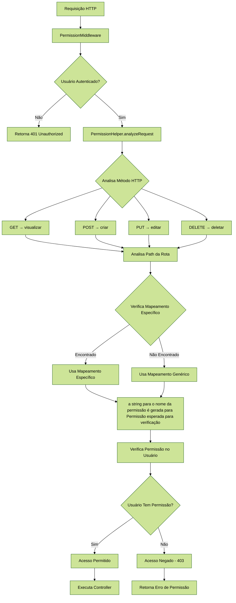
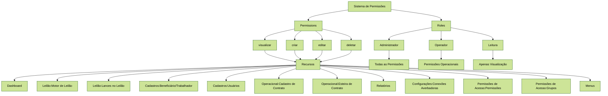
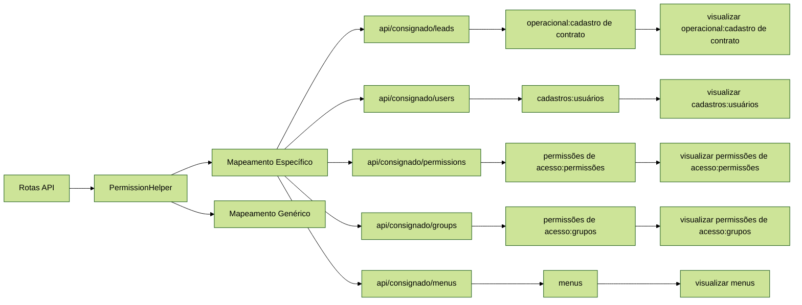
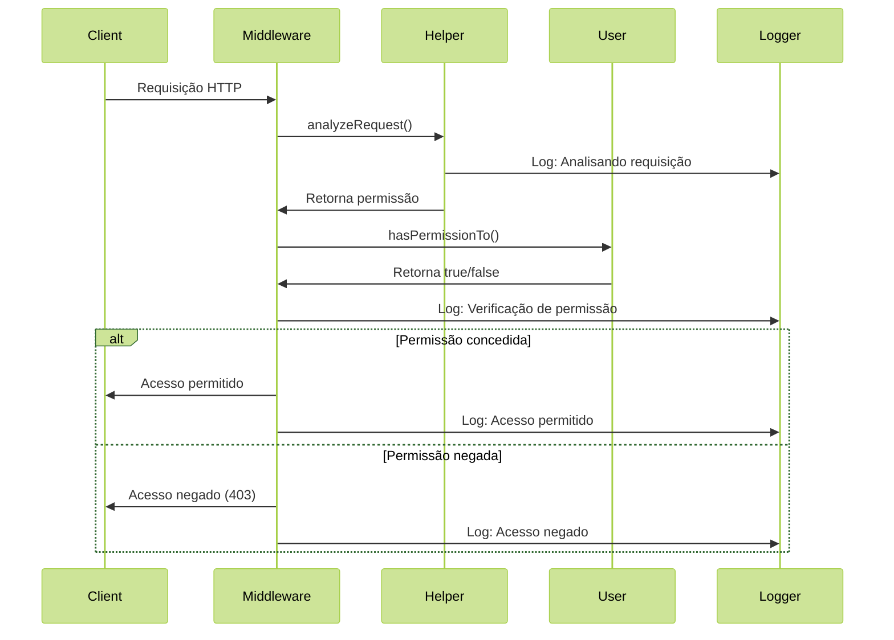

# Sistema de Middleware de Permissões - Predição Estática

## Visão Geral

O sistema implementa um middleware de permissões baseado em predição estática, que analisa automaticamente as rotas e determina as permissões necessárias sem configuração manual. O sistema utiliza o Spatie Laravel Permission para gerenciamento de roles e permissões.

## Arquitetura

### Componentes Principais

1. **PermissionHelper** - Helper para análise estática de rotas
2. **PermissionMiddleware** - Middleware para verificação automática
3. **User Model** - Modelo com trait HasRoles do Spatie
4. **Comandos Artisan** - Ferramentas para teste e gerenciamento

### Fluxo de Funcionamento
````
Requisição → PermissionMiddleware → PermissionHelper → Análise Estática 
→ Verificação de Permissão
````



## Como Funciona

### 1. Análise Estática de Rotas

O `PermissionHelper` analisa automaticamente:
- **Método HTTP** → Determina a ação (GET=visualizar, POST=criar, etc.)
- **Path da rota** → Determina o recurso (leads, usuários, etc.)
- **Combinação** → Gera permissão (ex: "visualizar leads")

### 2. Mapeamento Automático

```php
// Métodos HTTP → Ações
GET    → visualizar
POST   → criar  
PUT    → editar
DELETE → deletar

// Paths → Recursos (mapeamento específico)
api/consignado/leads     → operacional:cadastro de contrato
api/consignado/users     → cadastros:usuários
api/consignado/permissions → permissões de acesso:permissões
api/consignado/groups    → permissões de acesso:grupos
api/consignado/menus     → menus
```

### 3. Verificação de Permissões

O middleware verifica se o usuário possui a permissão necessária usando o Spatie Permission.

## Estrutura de Permissões

### Hierarquia de Permissões



### Mapeamento de Rotas para Permissões



## Configuração

### 1. Registrar Middleware

O middleware está registrado em `bootstrap/app.php`:

```php
$middleware->alias([
    'permission.check' => \App\Http\Middleware\PermissionMiddleware::class,
]);
```

### 2. Aplicar em Grupos de Rotas

```php
Route::prefix('consignado')->group(function () {
    Route::middleware(['permission.check'])->group(function () {
        // As rotas verificas...
        Route::get('/leads', [LeadController::class, 'index']);
        Route::post('/leads', [LeadController::class, 'store']);
    });
});
```

### 3. Rotas Ignoradas

O sistema ignora automaticamente rotas de sistema:
- `health`
- `auth/*`
- `login/logout`
- `password/*`
- `sanctum/*`
- `api/health`

## Uso Prático

### Exemplo de Mapeamento

| Rota | Método | Permissão Gerada |
|------|--------|------------------|
| `GET /api/consignado/leads` | GET | `visualizar operacional:cadastro de contrato` |
| `POST /api/consignado/leads` | POST | `criar operacional:cadastro de contrato` |
| `GET /api/consignado/users` | GET | `visualizar cadastros:usuários` |
| `POST /api/consignado/users` | POST | `criar cadastros:usuários` |
| `GET /api/consignado/permissions` | GET | `visualizar permissões de acesso:permissões` |
| `GET /api/consignado/groups` | GET | `visualizar permissões de acesso:grupos` |
| `GET /api/consignado/menus/available-permissions` | GET | `visualizar menus` |

### Verificação Automática

```php
// O middleware verifica automaticamente:
$user->hasPermissionTo('visualizar operacional:cadastro de contrato'); // Para GET /api/consignado/leads
$user->hasPermissionTo('criar cadastros:usuários');                   // Para POST /api/consignado/users
```

## Comandos Artisan

### 1. Testar Permissões

```bash
# Listar todas as permissões
php artisan permission:test --list

# Analisar todas as rotas
php artisan permission:test --analyze

# Testar rota específica
php artisan permission:test --route=api/consignado/leads --method=GET

# Testar com usuário específico
php artisan permission:test --route=api/consignado/users --method=POST --user=1 
```

### 2. Aplicar Middleware

```bash
# Aplicar em rotas API (simulação)
php artisan permission:apply-middleware --routes=api --dry-run

# Aplicar em rotas Web
php artisan permission:apply-middleware --routes=web

# Forçar aplicação
php artisan permission:apply-middleware --routes=api --force
```

### 3. Gerenciar Usuários

```bash
# Atribuir role a usuário
php artisan users:assign-role {user_id} {role_name}

# Criar usuários do sistema - APENAS PARA AMBIENTES LOCAIS DEV e TESTE!
php artisan users:create-system-users

# Sincronizar usuários órfãos - Usuarios criados em Keycloak_ID
php artisan users:sync-orphans
```

## Estrutura de Permissões

### Permissões Geradas Automaticamente

O sistema gera permissões baseadas nos menus:

```php
$menus = [
    'Dashboard',
    'Leilão:Motor de Leilão', 
    'Leilão:Lances no Leilão',
    'Cadastros:Beneficiário/Trabalhador',
    'Cadastros:Usuários',
    'Operacional:Cadastro de Contrato',
    'Operacional:Esteira de Contrato',
    'Relatórios:Relatório A',
    'Relatórios:Relatório B',
    'Relatórios:Relatório C',
    'Configurações:Conexões Averbadoras',
    'Permissões de Acesso:Permissões',
    'Permissões de Acesso:Grupos',
    'Menus',
];

$actions = ['visualizar', 'criar', 'editar', 'deletar'];

// Gera: visualizar {exemplo}, criar {exemplo}, editar {exemplo}, deletar {exemplo}
//       visualizar leilão:motor de leilão, criar leilão:motor de leilão, etc.
```

### Roles Padrão

```php
// Administrador - Todas as permissões
'Administrador' => 'all'

// Operador - Permissões específicas
'Operador' => [
    'visualizar dashboard',
    'visualizar leilão:motor de leilão',
    'visualizar leilão:lances no leilão',
    'visualizar cadastros:beneficiário/trabalhador',
    'criar cadastros:beneficiário/trabalhador',
    'editar cadastros:beneficiário/trabalhador',
    'visualizar cadastros:usuários',
    'criar cadastros:usuários',
    'editar cadastros:usuários',
    'visualizar operacional:cadastro de contrato',
    'criar operacional:cadastro de contrato',
    'editar operacional:cadastro de contrato',
    'visualizar operacional:esteira de contrato',
    'criar operacional:esteira de contrato',
    'editar operacional:esteira de contrato',
    'visualizar relatórios:relatório a',
    'visualizar relatórios:relatório b',
    'visualizar relatórios:relatório c',
    'visualizar configurações:conexões averbadoras',
    'visualizar permissões de acesso:permissões',
    'visualizar permissões de acesso:grupos',
]

// Leitura - Apenas visualização
'Leitura' => [
    'visualizar dashboard',
    'visualizar leilão:motor de leilão',
    'visualizar leilão:lances no leilão',
    'visualizar cadastros:beneficiário/trabalhador',
    'visualizar cadastros:usuários',
    'visualizar operacional:cadastro de contrato',
    'visualizar operacional:esteira de contrato',
    'visualizar relatórios:relatório a',
    'visualizar relatórios:relatório b',
    'visualizar relatórios:relatório c',
    'visualizar configurações:conexões averbadoras',
]
```

## Logs e Monitoramento

### Fluxo de Logs



### Logs Detalhados

O sistema gera logs completos:

```php
// Log de análise
'PermissionHelper::analyzeRequest - Analisando requisição' => [
    'path' => 'api/consignado/leads',
    'method' => 'GET',
    'url' => 'http://localhost/api/consignado/leads'
]

// Log de verificação
'PermissionMiddleware - Verificação de permissão' => [
    'user_id' => 1,
    'user_email' => 'admin@econsignado.com',
    'path' => 'api/consignado/leads',
    'method' => 'GET',
    'required_permission' => 'visualizar operacional:cadastro de contrato',
    'has_permission' => true,
    'user_roles' => ['Administrador'],
    'user_permissions' => ['visualizar operacional:cadastro de contrato', 'criar operacional:cadastro de contrato', ...]
]
```

### Respostas de Erro

```json
{
    "message": "Acesso negado. Você não possui permissão para acessar este recurso.",
    "code": "PERMISSION_DENIED",
    "required_permission": "visualizar operacional:cadastro de contrato",
    "path": "api/consignado/leads",
    "method": "GET"
}
```

## Vantagens do Sistema

### 1. **Automatização**
- Não precisa configurar permissões em cada rota
- Análise automática baseada em padrões
- Mapeamento inteligente de rotas

### 2. **Consistência**
- Padrão uniforme de permissões
- Nomenclatura consistente
- Verificação centralizada

### 3. **Manutenibilidade**
- Fácil adição de novas rotas
- Configuração centralizada
- Logs detalhados para debug

### 4. **Flexibilidade**
- Rotas ignoradas automaticamente
- Fallback para rotas não mapeadas
- Configuração por grupos

## Exemplos de Uso

### 1. Rota Simples

```php
// GET /api/consignado/leads
// Permissão: visualizar operacional:cadastro de contrato
Route::get('/leads', [LeadController::class, 'index']);
```

### 2. Rota com Parâmetros

```php
// PUT /api/consignado/users/123
// Permissão: editar cadastros:usuários
Route::put('/users/{id}', [UserController::class, 'update']);
```

### 3. Rota de Permissões

```php
// GET /api/consignado/permissions
// Permissão: visualizar permissões de acesso:permissões
Route::get('/permissions', [PermissionController::class, 'index']);
```

## Troubleshooting

### Problemas Comuns

1. **Permissão não identificada**
   - Verificar se a rota está no mapeamento específico
   - Adicionar novo padrão no PermissionHelper
   - Verificar logs para análise

2. **Acesso negado inesperado**
   - Verificar se usuário tem a role correta
   - Verificar se permissão existe no banco
   - Usar comando de teste para debug

3. **Rota sendo ignorada**
   - Verificar lista de rotas ignoradas
   - Adicionar rota ao mapeamento se necessário

### Comandos de Diagnóstico

```bash
# Verificar permissões do usuário
php artisan permission:test --user=1 --route=api/consignado/leads

# Analisar todas as rotas
php artisan permission:test --analyze

# Verificar logs
tail -f storage/logs/laravel.log | grep Permission
```

## Extensibilidade

### Adicionar Novos Mapeamentos

```php
// Em PermissionHelper.php
private static array $specificRouteToResource = [
    'api/consignado/leads' => 'operacional:cadastro de contrato',
    'api/consignado/users' => 'cadastros:usuários',
    'api/consignado/novo-recurso' => 'novo recurso', // No exemplo você adiciona aqui!
];
```

### Adicionar Novas Ações

```php
private static array $methodToAction = [
    'GET' => 'visualizar',
    'POST' => 'criar',
    'PUT' => 'editar',
    'PATCH' => 'editar',
    'DELETE' => 'deletar',
    'OPTIONS' => 'visualizar', // Adicionar aqui
];
```

## Segurança

### Boas Práticas

1. **Princípio do Menor Privilégio**
   - Usuários recebem apenas permissões necessárias
   - Roles bem definidas e limitadas

2. **Logs de Auditoria**
   - Todas as verificações são logadas
   - Rastreamento completo de acessos

3. **Fallback Seguro**
   - Em caso de erro, acesso é negado
   - Logs detalhados para investigação

4. **Validação de Permissões**
   - Permissões são validadas antes do uso
   - Verificação de existência no banco

## Integração com Keycloak

### Sincronização de Usuários

O sistema suporta sincronização com Keycloak:

```bash
# Criar usuários do sistema
php artisan users:create-system-users

# Sincronizar usuários órfãos
php artisan users:sync-orphans

# Verificar consistência
php artisan users:check-consistency
```

### Usuários do Sistema

O sistema cria automaticamente três usuários padrão:
- **Administrador** (admin@econsignado.com) - Todas as permissões
- **Operador** (operador@econsignado.com) - Permissões operacionais
- **Leitor** (leitor@econsignado.com) - Apenas visualização

## Conclusão

O sistema de middleware com predição estática oferece uma solução robusta e automatizada para controle de acesso, eliminando a necessidade de configuração manual de permissões em cada rota, mantendo a segurança e facilitando a manutenção do sistema. A integração com Keycloak garante sincronização adequada de identidades e o sistema de logs permite monitoramento completo das atividades.