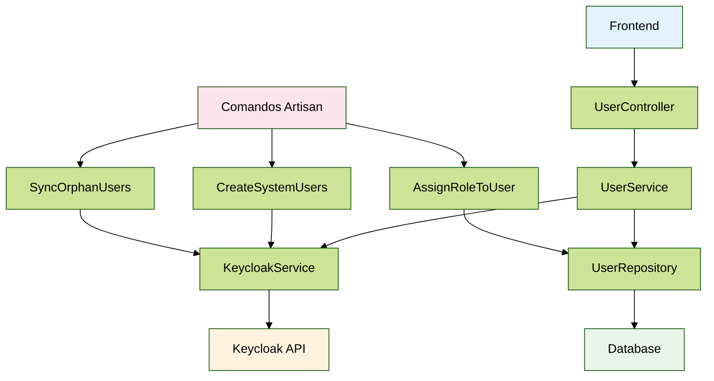
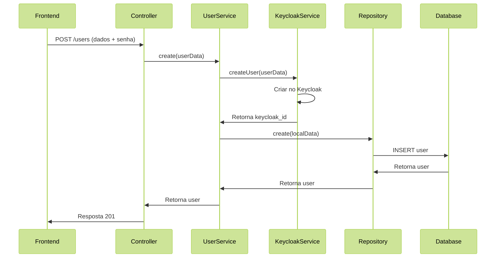
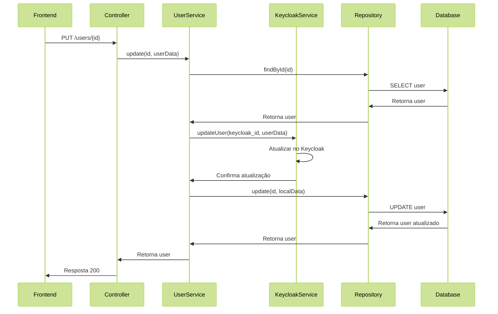
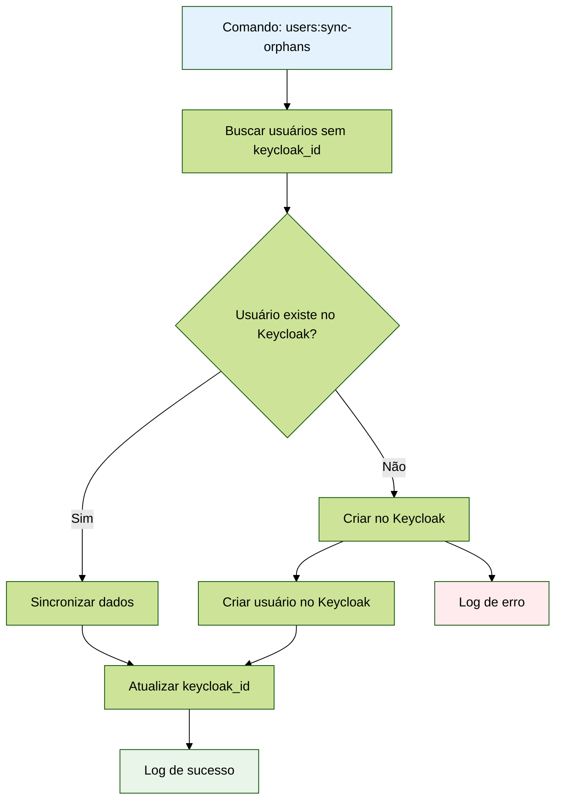
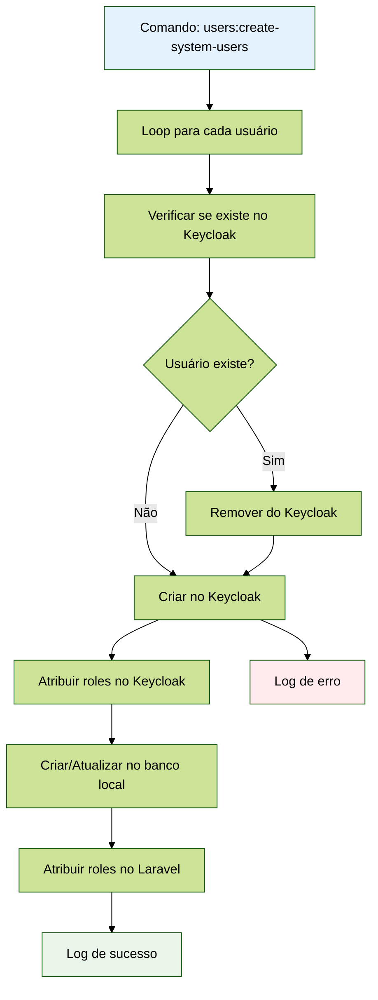
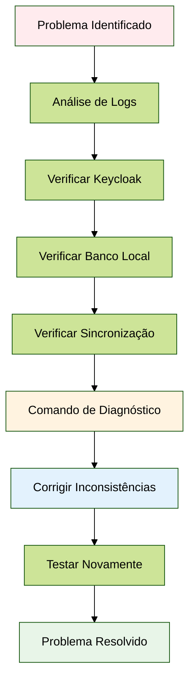

# Fluxo de Sincronização de Usuários - Laravel + Keycloak

## Visão Geral

O sistema implementa sincronização bidirecional entre o banco de dados local (Laravel) e o Keycloak, garantindo consistência de dados e gerenciamento adequado de identidades. O sistema suporta criação automática de usuários do sistema com roles e permissões predefinidas.

## Arquitetura

### Componentes Principais

1. **UserController** - Controlador principal do CRUD
2. **KeycloakService** - Serviço de comunicação com Keycloak
3. **UserSyncService** - Serviço de sincronização bidirecional
4. **UserService** - Serviço de gerenciamento de usuários
5. **UserRepository** - Repository pattern para operações de usuário
6. **Comandos Artisan** - Ferramentas para criação e sincronização

### Fluxo de Dados
````
Frontend → UserController → UserService → 
KeycloakService → Keycloak API
                ↓
            UserRepository → Database
````



## Operações CRUD

### CREATE (Criar Usuário)



1. **Validação** - Dados do formulário são validados (incluindo senha obrigatória)
2. **Criação no Keycloak** - Usuário é criado primeiro no Keycloak com senha fornecida
3. **Sincronização Local** - Dados são sincronizados para o banco local
4. **Retorno** - Dados do usuário criado são retornados

```php
// Fluxo no UserController::store()
$userData = [
    'email' => $request->input('email'),
    'name' => $request->input('name'),
    'profile' => $request->input('profile'),
    'cpf' => $request->input('cpf'),
    'password' => $request->input('password') // Senha fornecida pelo usuário
];

$keycloakResult = $this->keycloakService->createUser($userData);
```

### READ (Listar Usuários)

- Consulta apenas o banco local
- Filtros por nome e CPF
- Paginação implementada

### UPDATE (Atualizar Usuário)



1. **Validação** - Dados são validados
2. **Verificação** - Confirma se usuário possui keycloak_id
3. **Atualização Keycloak** - Dados são atualizados no Keycloak primeiro
4. **Sincronização Local** - Dados são sincronizados localmente

### DELETE (Excluir Usuário)

1. **Verificação** - Confirma se usuário possui keycloak_id
2. **Exclusão Keycloak** - Usuário é removido do Keycloak
3. **Exclusão Local** - Usuário é removido do banco local (soft delete)

## Gerenciamento de Senhas

### Senha Fornecida pelo Usuário

- **Validação**: Senha obrigatória com mínimo 6 caracteres
- **Aplicação**: Usuários criados via CRUD fornecem sua própria senha
- **Segurança**: Senha é enviada diretamente para o Keycloak

```php
// Validação no controller
'password' => 'required|string|min:6'

// Envio para Keycloak
'password' => $request->input('password')
```

## Tratamento de Erros

### Tipos de Erro

1. **ValidationException** - Dados inválidos (422)
2. **ModelNotFoundException** - Usuário não encontrado (404)
3. **KeycloakException** - Erro de comunicação com Keycloak (500)
4. **DatabaseException** - Erro de banco de dados (500)

### Logs Detalhados

Todas as operações são logadas com:
- Timestamp
- Operação realizada
- Dados de entrada (sem senhas)
- Resultado da operação
- Stack trace em caso de erro

## Sincronização de Usuários Órfãos

### Fluxo de Sincronização



### Comando Artisan

```bash
# Sincronizar usuários sem keycloak_id
php artisan users:sync-orphans

# Forçar sincronização mesmo com erros
php artisan users:sync-orphans --force

# Verificar consistência entre Laravel e Keycloak
php artisan users:check-consistency

# Validar que todos os usuários tenham keycloak_id
php artisan users:validate-keycloak-ids
```

## Permissões e Roles

### Usuários Criados via CRUD

- **Role Padrão**: `view-users` (apenas visualização)
- **Gerenciamento**: Permissões são controladas pelo laravel-permissions
- **Segurança**: Usuários não recebem permissões administrativas

### Roles no Keycloak

```php
private function getRolesByProfile(string $profile): array
{
    // Usuários criados via CRUD são sempre usuários comuns
    // As permissões são gerenciadas pelo laravel-permissions
    return ['view-users']; // Apenas permissão básica de visualização
}
```

## Usuários do Sistema

### Criação Automática

O sistema suporta criação automática de três usuários padrão:

```bash
# Criar usuários do sistema
php artisan users:create-system-users
```

### Fluxo de Criação de Usuários do Sistema



### Usuários Criados

1. **Administrador** (admin@econsignado.com)
   - **CPF**: 11111111111
   - **Senha**: webconsignado@2024
   - **Role**: Administrador (todas as permissões)
   - **Perfil**: Administrador

2. **Operador** (operador@econsignado.com)
   - **CPF**: 22222222222
   - **Senha**: webconsignado@2024
   - **Role**: Operador (permissões operacionais)
   - **Perfil**: Operador

3. **Leitor** (leitor@econsignado.com)
   - **CPF**: 33333333333
   - **Senha**: webconsignado@2024
   - **Role**: Leitura (apenas visualização)
   - **Perfil**: Leitura

### Permissões por Role

```mermaid
%%{init: {'theme': 'forest'}}%%
graph TD
    A[Usuários do Sistema] --> B[Administrador]
    A --> C[Operador]
    A --> D[Leitura]
    
    B --> E[Todas as Permissões]
    C --> F[Permissões Operacionais]
    D --> G[Apenas Visualização]
    
    E --> H[visualizar operacional:cadastro de contrato]
    E --> I[criar operacional:cadastro de contrato]
    E --> J[editar operacional:cadastro de contrato]
    E --> K[deletar operacional:cadastro de contrato]
    E --> L[visualizar cadastros:usuários]
    E --> M[criar cadastros:usuários]
    E --> N[editar cadastros:usuários]
    E --> O[deletar cadastros:usuários]
    
    F --> P[visualizar operacional:cadastro de contrato]
    F --> Q[criar operacional:cadastro de contrato]
    F --> R[editar operacional:cadastro de contrato]
    F --> S[visualizar cadastros:usuários]
    F --> T[criar cadastros:usuários]
    F --> U[editar cadastros:usuários]
    
    G --> V[visualizar operacional:cadastro de contrato]
    G --> W[visualizar cadastros:usuários]
    
    style A fill:#e3f2fd
    style B fill:#e8f5e8
    style C fill:#fff3e0
    style D fill:#fce4ec
```



#### Administrador
- Todas as permissões do sistema
- Acesso completo a todas as funcionalidades

#### Operador
- Visualizar, criar e editar operacionais
- Visualizar, criar e editar cadastros
- Visualizar relatórios e configurações
- Visualizar permissões e grupos

#### Leitura
- Apenas visualização de dados
- Sem permissão para criar, editar ou deletar

## Configuração

### Variáveis de Ambiente

```env
KEYCLOAK_BASE_URL=http://localhost:8080
KEYCLOAK_REALM=e-consignado
KEYCLOAK_CLIENT_ID=e-consignado
KEYCLOAK_CLIENT_SECRET=your-secret
KEYCLOAK_ADMIN_USERNAME=admin
KEYCLOAK_ADMIN_PASSWORD=admin
```

### Configuração do Keycloak

1. **Realm**: Deve existir e estar configurado
2. **Client**: Deve estar configurado com client secret
3. **Admin User**: Deve ter permissões de administração
4. **Roles**: Roles do sistema devem existir

## Monitoramento

### Logs Importantes

- `UserController::*` - Operações CRUD
- `UserSyncService::*` - Sincronizações
- `KeycloakService::*` - Comunicação com Keycloak
- `CreateSystemUsers::*` - Criação de usuários do sistema

### Métricas

- Total de usuários sincronizados
- Taxa de sucesso nas operações
- Tempo de resposta das operações
- Inconsistências detectadas

## Troubleshooting

### Fluxo de Resolução de Problemas



### Problemas Comuns

1. **Usuário não encontrado no Keycloak**
   - Verificar se o keycloak_id está correto
   - Verificar se o usuário não foi deletado manualmente

2. **Erro de autenticação com Keycloak**
   - Verificar credenciais de admin
   - Verificar se o realm existe

3. **Senha não aceita**
   - Verificar política de senhas do Keycloak
   - Verificar se a senha atende aos critérios

4. **CPF duplicado**
   - Verificar se o CPF já existe no banco
   - Usar CPFs únicos para cada usuário

### Comandos de Diagnóstico

```bash
# Verificar consistência
php artisan users:check-consistency

# Sincronizar usuários órfãos
php artisan users:sync-orphans

# Verificar logs
tail -f storage/logs/laravel.log
```

## Segurança

### Boas Práticas

1. **Keycloak ID Obrigatório**: Todos os usuários devem ter keycloak_id
2. **Logs Seguros**: Senhas nunca são logadas
3. **Validação**: Dados sempre validados
4. **Permissões Mínimas**: Usuários recebem apenas permissões básicas
5. **Soft Delete**: Usuários não são excluídos permanentemente

### Considerações

- Todos os usuários devem ter keycloak_id obrigatório
- Usuários administrativos devem ser criados manualmente no Keycloak
- Backup regular dos dados é recomendado
- Monitoramento de logs é essencial

## Comandos Disponíveis

### Gerenciamento de Usuários

```bash
# Atribuir role a usuário
php artisan users:assign-role {user_id} {role_name}

# Criar usuários do sistema
php artisan users:create-system-users

# Sincronizar usuários órfãos
php artisan users:sync-orphans

# Verificar consistência
php artisan users:check-consistency
```

### Teste de Permissões

```bash
# Testar permissões de usuário
php artisan permission:test --user={user_id} --route={route} --method={method}

# Listar todas as permissões
php artisan permission:test --list

# Analisar rotas
php artisan permission:test --analyze
```

## Conclusão

O sistema de sincronização de usuários oferece uma solução robusta para gerenciamento de identidades, garantindo consistência entre Laravel e Keycloak. A criação automática de usuários do sistema facilita a configuração inicial e o sistema de logs permite monitoramento completo das operações. 