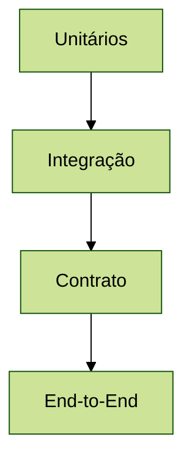

# Test Strategy
## Estratégia de Testes do Sistema

### Versão: 1.0
### Data: 07-2025

## 1. Abordagem

A estratégia de testes adota abordagem shift-left, priorizando automação, cobertura e integração contínua desde o início do desenvolvimento.

## 2. Pirâmide de Testes

## 3. Automação
- Testes unitários e integração automatizados no CI
- E2E automatizado em ambientes de homologação
- Testes de regressão automáticos a cada release
- Gatilhos automáticos para testes de segurança

## 4. Ambientes de Teste
- Dev: testes rápidos, mocks e stubs
- Staging: ambiente próximo ao produtivo
- Prod: monitoramento e smoke tests

## 5. Métricas
- Cobertura de testes (%)
- Tempo médio de execução
- Falhas por release
- Bugs encontrados em produção
- Tempo de resposta dos testes

